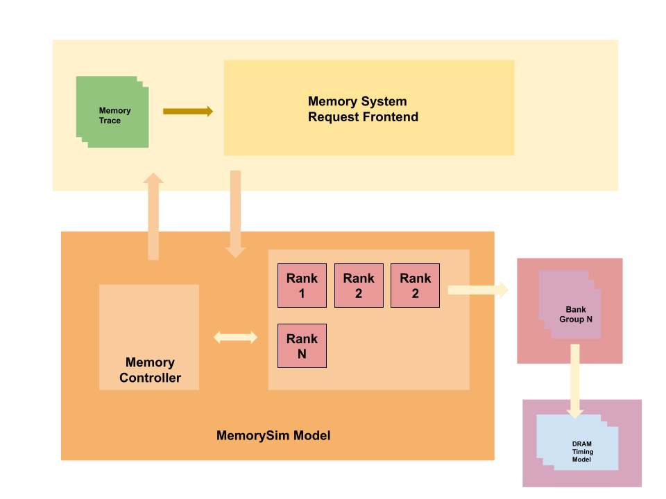

# MemorySim: An RTL-Level Simulator Model for High Performance Memory Subsystems

**MemorySim** is an RTL-native, timing-accurate memory simulator designed for the Chisel/Chipyard ecosystem. It provides cycle-accurate profiling of memory subsystems, enabling hardware designers to evaluate bandwidth, latency, and power-performance trade-offs in next-generation AI accelerators.

## Features

- **RTL-Level Fidelity**  
  Implements bank-level finite-state machines (FSMs) and a comprehensive DRAM timing model entirely in hardware for bit-true data correctness.  
- **Seamless Integration**  
  Compatible with Chisel and Verilog-based designs; easily embedded into Chipyard and FireSim flows for FPGA-accelerated emulation.  
- **Cycle-Accurate DRAM Model**  
  Supports key JEDEC timing parameters (e.g., tRCD, tRP, tRFC) with closed-page policy and self-refresh modes.  
- **Backpressure Analysis**  
  Centralized request queue with multi-dequeue support to study the impact of queue depth on latency and throughput.  
- **Trace-Driven and Standalone Modes**  
  Run isolated trace-based experiments or co-simulate with full-system benchmarks.

## Architecture Overview

1. **Top-Level Interface**  
   - Frontend accepts memory trace requests (`addr`, `cycle`) and enqueues into `reqQueue`.  
2. **Memory Controller**  
   - Splits requests by rank and bank, dispatches to bank schedulers, and aggregates responses in `respQueue`.  
3. **Bank Scheduler**  
   - Enforces closed-page policy, manages ACTIVATE–READ/WRITE–PRECHARGE handshakes, and handles refresh/self-refresh states.  
4. **DRAM Timing Model**  
   - Tracks timing constraints (e.g., tRCD, tRP, tRFC) and issues acknowledgments after parameterized delays.  
5. **Physical Channel Hierarchy**  
   - Models channels, ranks, bank groups, and banks with round-robin arbitration for responses.



## Experimentation & Results

We evaluated MemorySim against DRAMSim3 using four microbenchmarks: `conv2d.c`, `multihead_attention.c`, `trace_example.c`, and `vector_similarity.c`. Key findings:

- **Read/Write Overhead**  
  - Average read penalty: ~111 cycles  
  - Average write penalty: ~125 cycles  
- **Latency vs. Queue Depth**  
  - Exponential latency growth with larger `reqQueue` sizes; sub-80 cycles at queue size 2, >250 cycles at size 1024.  
- **Throughput–Latency Trade-off**  
  - Smaller queues reduce latency but can starve bank schedulers, lowering overall requests served.

For detailed metrics, refer to the results section of the [paper](docs/paper.pdf).

## Getting Started

### Prerequisites

- [Chisel](https://www.chisel-lang.org/) (Scala 2.13+, SBT)
- [Chipyard](https://github.com/chipsalliance/chipyard)
- [FireSim](https://github.com/firesim/firesim) (optional for FPGA emulation)

### Installation

```bash
git clone https://github.com/AnshKetchum/hbm-controller.git
cd hbm-controller
# Build Chisel project
sbt compile
```

### Running Simulations

```bash
# Trace-driven standalone mode
sbt "runMain memsim.TraceRunner --trace-file traces/conv2d.trace --queue-size 128"

# Co-simulation within Chipyard/FireSim
cd chipyard
./scripts/generate-configs.sh
make hbm-sim-project
```

## Benchmarks

- `conv2d.c`: 2D convolution kernel  
- `multihead_attention.c`: Toy attention workload  
- `trace_example.c`: Basic sequence validation  
- `vector_similarity.c`: Cosine similarity search  

Trace generators and scripts are located in `benchmarks/`.

## Citation

If you use MemorySim in your research, please cite:

```
@inproceedings{chaurasia2025mem,
  title={MemorySim: An RTL-level, timing accurate simulator model for the Chisel ecosystem},
  author={Chaurasia, Ansh},
  booktitle={},
  year={2025},
  pages={1--8}
}
```

## Acknowledgements

Thanks to Professor Christopher Fletcher, Professor Sagar Karandikar, and Ph.D Tianrui Wei for their invaluable guidance through the process.
